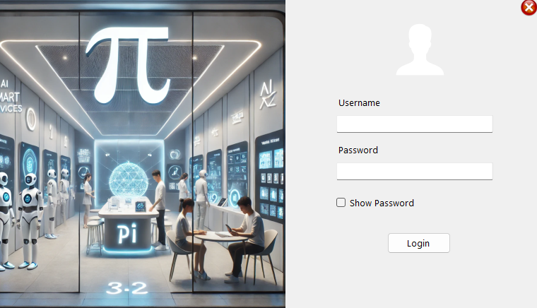
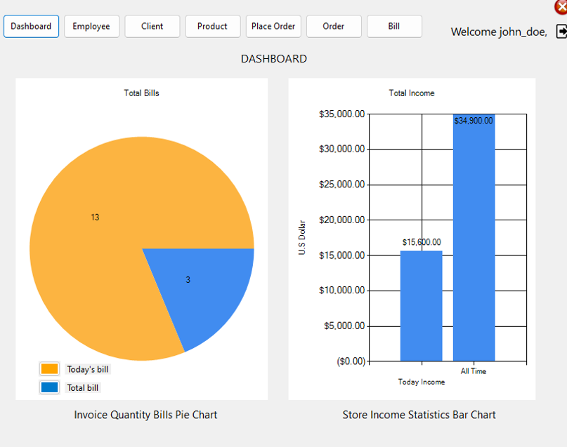
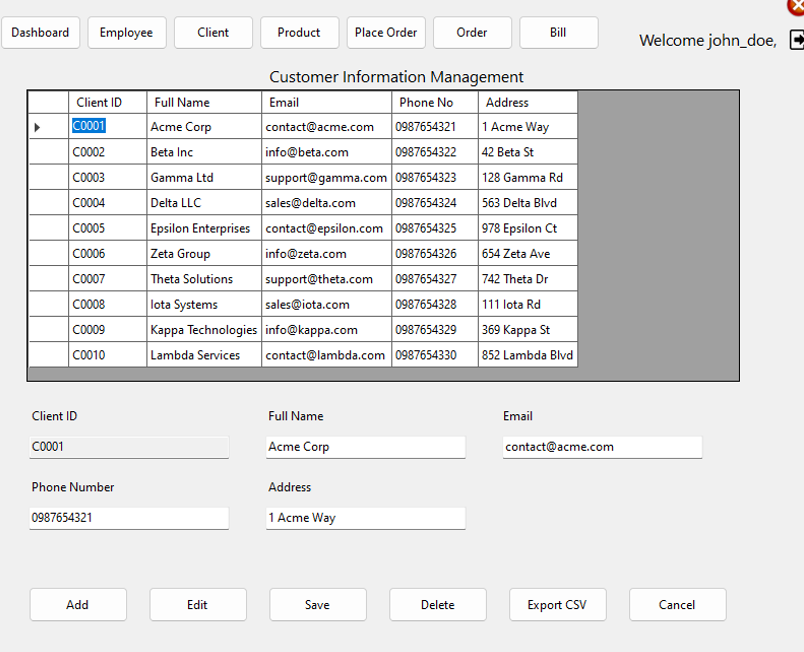

# 🛒 Pi Store Management Software

A comprehensive desktop application developed in C# with SQL Server for efficient management of store operations such as employee, client, product, order, and billing systems.

  
  


## 📌 Overview

Pi Store Management Software is a .NET-based Windows Forms application built for streamlining daily operations at a retail store. It automates critical business functions like:

- Employee and client management  
- Product inventory tracking  
- Order placement and processing  
- Automated invoice generation  
- Data export and visualization

The project was developed as a midterm assignment for the .NET Engineering course at **Ton Duc Thang University**, supervised by **PhD. Nguyen Ngoc Phien**.

## 🧑‍💻 Author

- **Nguyễn Thành Đạt** aka **DatDev**
- [GitHub Repository](https://github.com/realthdat/Coffee_Store_Management.git)

## 🎯 Features

### 🔐 User Management
- Role-based access: Admin, Employee, Cashier
- Secure login and session handling

### 👥 Employee & Client Management
- Add/edit/delete employee and client data
- View order history and basic analytics

### 📦 Product Inventory
- Add/update/delete products
- Real-time stock updates
- Low-stock alerts

### 📋 Order Processing
- Add/remove products to cart
- Place orders, cancel, view history

### 💳 Billing System
- Invoice creation and payment tracking
- Discount support
- Export invoices to CSV

### 📊 Reporting & Extras
- Sales report generation
- CSV Export (Clients, Products, Orders)
- Visual charts for analytics

## 🧱 Architecture

The system uses a **Three-Layer Architecture**:

1. **Presentation Layer (UI):** Windows Forms  
2. **Business Logic Layer (BLL):** Core logic and validation  
3. **Data Access Layer (DAL):** SQL Server interaction

## ⚙️ Technologies Used

- **Language:** C# (.NET Framework)
- **Database:** SQL Server
- **IDE:** Visual Studio
- **Tools:** Trello (PM), Git (Version Control)

## 📋 Project Structure

```bash
.
├── Forms/
│   ├── LoginForm.cs
│   ├── MainForm.cs
│   └── ...
├── BLL/
│   └── EmployeeManager.cs
├── DAL/
│   └── Database.cs
├── Models/
│   └── Product.cs
├── Resources/
│   └── App.config
└── README.md
```

## 🧪 Testing

Over 30 test cases were performed including:

- ✅ Login/logout
- ✅ Add/update/delete for employees, clients, products
- ✅ Role-based access checks
- ✅ Order validation
- ✅ Error handling and edge case management

Some failed tests:

- ❌ Discount logic validation
- ❌ Session timeout behavior

## 📸 Screenshots

See full UI walkthrough in project report

| Login Page | Main Dashboard | Client Form |
|------------|----------------|-------------|
|  |  |  |

## 🗂 References

- Microsoft Docs – C# Fundamentals
- Waterfall SDLC Model – Tutorialspoint
- IEEE 829-2008 Testing Standard

## 📄 License

This project is part of a university academic requirement and not intended for commercial use. See [LICENSE](LICENSE) for more information.
